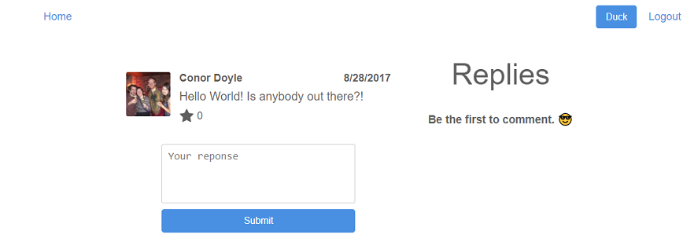

# Dukr
## [LIVE DEMO](https://dukr.conordoyle.io)

If you've learned Redux, then you've very liked encountered [Tyler McGinnis's Redux course](https://tylermcginnis.com/courses/redux), which is widely regarded as the best resource online for learning Redux. The only problem was that up until very recently the course hadn't been updated in about 2 years - a frickin' eon in the frontend dev world! So instead of blindly following along with the tutorial and just copying and pasting his old code, I decided to refactor it as I went along, making changes where possible to keep the application up-to-date with current React/Redux best-practices. So, out with the old 'React.createClass' syntax and in with the new 'extends Component' syntax, out with the old constructor syntax and in with public class fields, goodbye CSS Modules and hello Styled Components, later React Router 2 and howiya React Router 4, etc. I also migrated the project from it's creaking, old Webpack 2 configuration to a Create-React-App build (i.e. Webpack 4+) and added a Github authentication option to go alongside the original project's Facebook authentication.

I intend this to be a continual work-in-progress that I'll keep updated as front-end dev trends change, so I'm planning to soon add Flow, migrate it from Redux Thunk to Redux Sagas, add some Jest tests, and swap its Firebase relational database for a fancy GraphQL and Apollo setup. Mmmmmm! Watch this space.

## Getting Started

Just [download](https://github.com/chocobuckle/redux-dukr/archive/master.zip) the repository, unzip, then navigate to the 'build' folder and click on 'index.html' to open the page in your default browser, or if you're feeling lazy then just click [here](https://dukr.conordoyle.io) to view the live version via Firebase.
